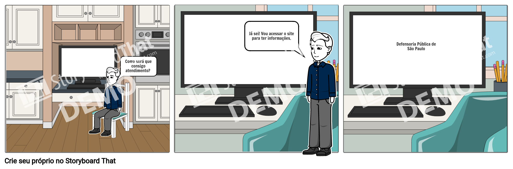
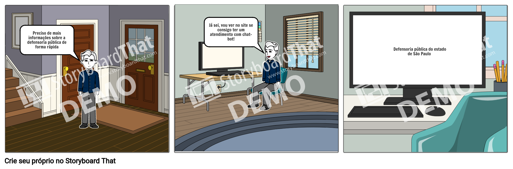

# Storyboard

## 1. Introdução

&emsp;Há duas formas de prototipagem, a prototipação de alta-fidelidade e a de baixa-fidelidade. A diferença entre os dois é que na de alta-fidelidade, o protótipo realizado fica muito parecido com o projeto final, enquanto o de baixa-fidelidade não se assemelha muito com o produto final.

&emsp;O storyboard é um exemplo de prototipação de baixa-fidelidade, o qual normalmente faz uso de cenários. Ela consiste em um conjunto de telas desenhadas que demostram como o usuário pode interagir no desenvolvimento das tarefas usando o produto que está sendo desenvolvido. 

## 2. Objetivo

&emsp; A prototipagem tem como objetivo transformar as ideias em algo mais concreto. Sendo esse o objetivo do storyboard
 

## 3. Metodologia

&emsp; Para o desenvolvimento deste documento, foi feita uma análise acima do documento de análise de tarefas. Para a realização dos quadrinhos, foi feita a utilização da ferramenta StoryBoardThat.

## 4. Resultado
#### Storyboard 1 - Receber atendimento 

#### Storyboard 2 - Atendimento virtual com chat-bot

## 8. Bibliografia
- MJV, Prototipagem: o guia definitivo para colocar sua ideia na rua. Disponível em:<https://www.mjvinnovation.com/pt-br/blog/prototipagem-o-guia-definitivo/#:~:text=A%20prototipagem%20%C3%A9%20a%20quarta,na%20fase%20anterior%2C%20a%20Idea%C3%A7%C3%A3o.&text=Seu%20objetivo%20%C3%A9%20revelar%20problemas%20de%20design%2C%20usabilidade%20ou%20adequa%C3%A7%C3%A3o.>. Acesso: 08/04/2020.
- PREECE, ROGERS E SHARP, Design de Interação: Além da interação homem-computador.
- SIMONE DINIZ JUNQUEIRO BARBOSA, BRUNO SANTANA DA SILVA, Interação Humano-Computador, 1a . Edição, Editora Campus, 2010

## Versionamento

| Data       | Versão | Descrição                    | Autor            |
| ---------- | ------ | ---------------------------- | ---------------- |
| 08/04/2021 | 1.0    | Desenvolvimento do Documento | Lorrany Oliveira |
| 09/04/2021 | 1.1    | Adiciona os storyboard | Lorrany Oliveira |
| 11/04/2021 | 2.0    | Revisa documento |Lucas Boaventura |
