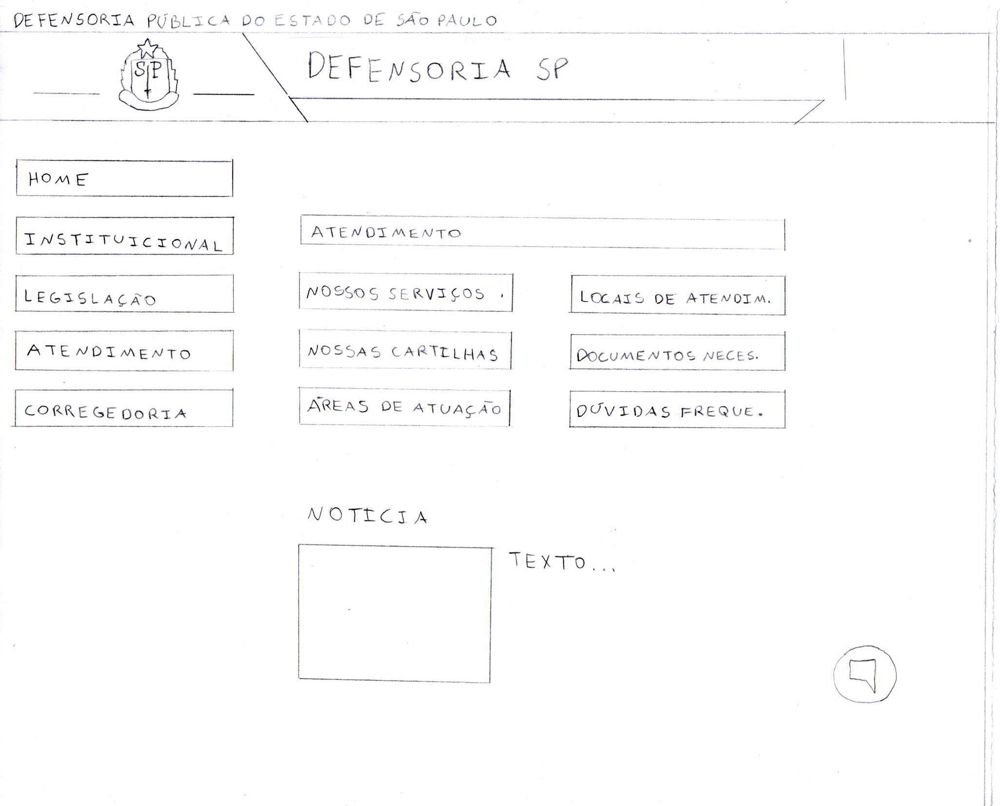
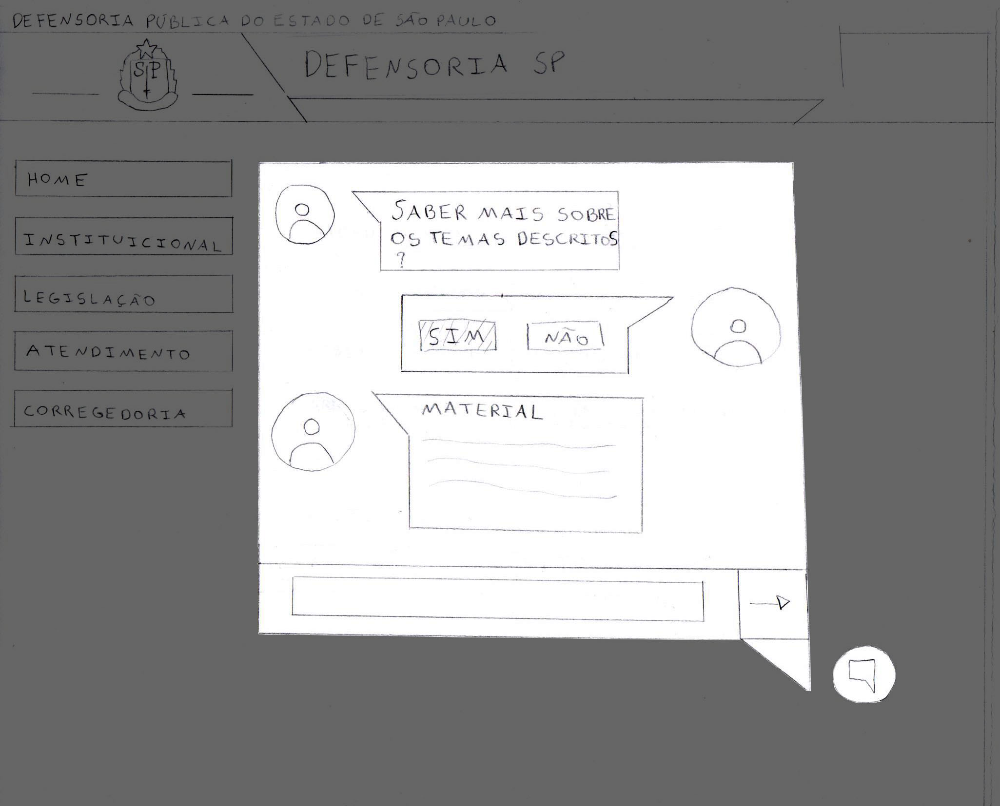
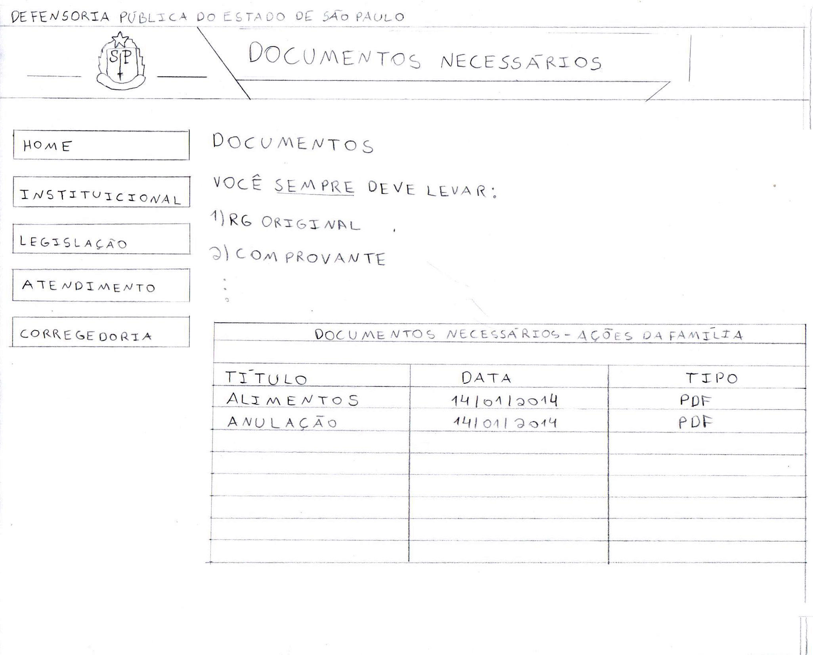
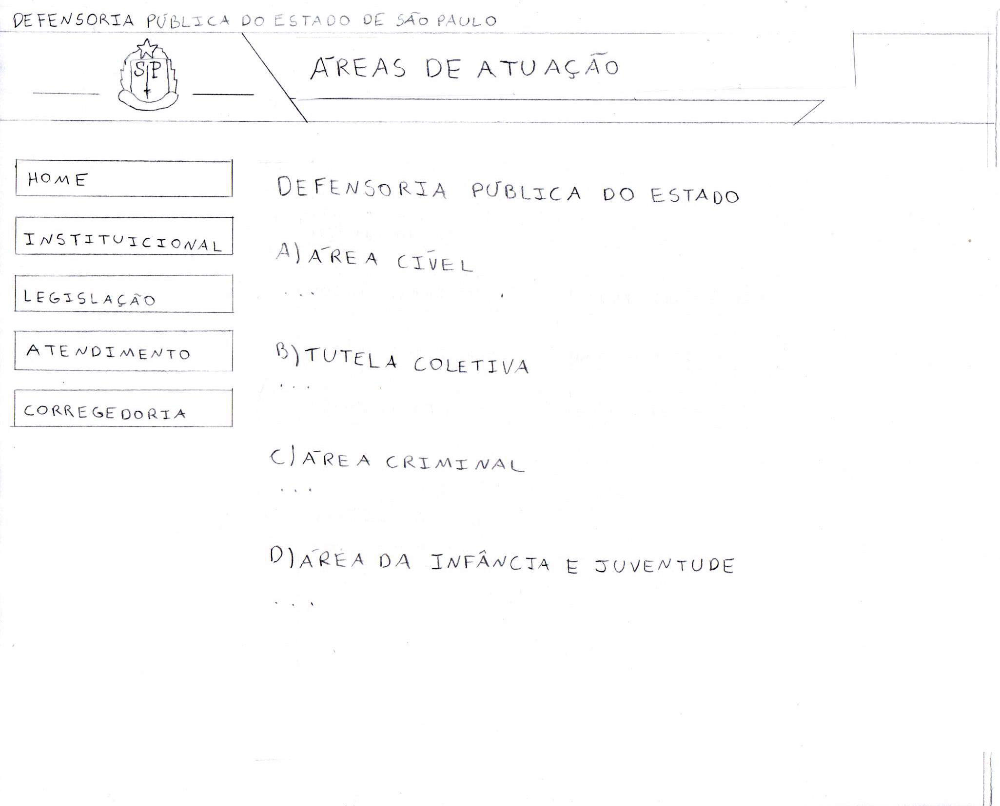
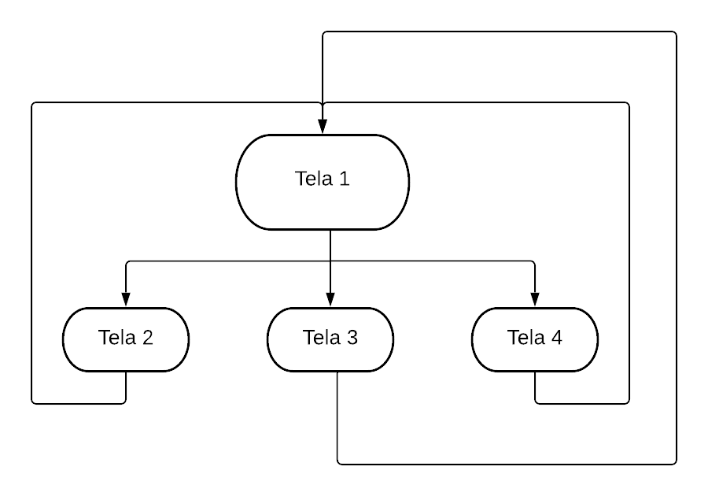

# Protótipo de papel

## 1. Introdução

&emsp;O método de prototipação em papel avalia a usabilidade de um design de IHC representado em papel, através de simulações de uso com a participação de potenciais usuários.  
&emsp;Simular o uso em papel é um modo rápido e barato de identificar problemas de usabilidade antes mesmo de construir uma solução de IHC executável. Sendo assim, esse método é uma opção interessante para uma avaliação formativa junto aos usuários, principalmente para comparar alternativas de design. Ele permite avaliar facilmente soluções parciais, que não cobrem toda a interface com usuário, e soluções de baixa e média fidelidade, que ainda não definem todos os detalhes da interface. (Barbosa e Silva, 2010)

## 2. Metodologia

&emsp;Foi realizado uma prototipação vertical, ou seja, um protótipo que explora um subgrupo de funcionalidades do sistema de forma aprofundada. Para criação dos protótipos de baixa fidelidade, foi utilizada a técnica manual com papel e lápis.
&emsp;As telas foram feitas de acordo com as tarefas definidas no documento Análise de Tarefas. O fluxo modelado tem o intuito de ser simples e intuitivo, de forma que o uso do sistema tenha uma alta usabilidade e não apresente dúvidas em relação a ordem que as tarefas devem ser executadas.

## 3. Protótipo de Baixa Fidelidade

<figcaption align="center">
    <b>Tela 1 - Página Inicial</b>
</figcaption>

<figcaption align="center">
    <small>Fonte: Autores</small>
</figcaption>

<figcaption align="center">
    <b>Tela 2 - Atendimento Virtual por chat-bot</b>
</figcaption>

<figcaption align="center">
    <small>Fonte: Autores</small>
</figcaption>

<figcaption align="center">
    <b>Tela 3 - Verificar Documentos Necessários</b>
</figcaption>

<figcaption align="center">
    <small>Fonte: Autores</small>
</figcaption>

<figcaption align="center">
    <b>Figura 4 - Áreas de Atuação da Defensoria</b>
</figcaption>

<figcaption align="center">
    <small>Fonte: Autores</small>
</figcaption>

## 4. Fluxo de navegação

<figcaption align="center" >
    <b>Figura 5 - Imagem do fluxo de navegação</b>
</figcaption>
<figcaption align="center">
    <small>Fonte: Autores</small>
</figcaption>

## 5. Bibliografia

- BARBOSA, S. D. J.; SILVA, B. S. Interação Humano-Computador. 1ª edição, Rio de Janeiro: Elsevier, 2010
- PREECE, J.; ROGERS, Y; SHARP, H. Design de Interação: Além da interação homem-computador. John Wiley e Sons. São Paulo - SP. 1ª Edição. Editora Erica, 2005.
- Lucidchart. Disponível em: <https://lucid.app>. Acesso em: 24 abr. 2021.

## Versionamento

|    Data    | Versão |                     Descrição                      |               Autor               |
| :--------: | :----: | :------------------------------------------------: | :-------------------------------: |
| 23/04/2021 |  1.0   | Desenvolvimento do documento do Protótipo de Papel | Guilherme Fernandes e Ítalo Alves |
| 23/04/2021 |  1.1   | Revisão do documento | Lucas Boaventura |
| 07/05/2021 |  1.2   | Revisa e padroniza documento | Tiago Samuel Rodrigues |
