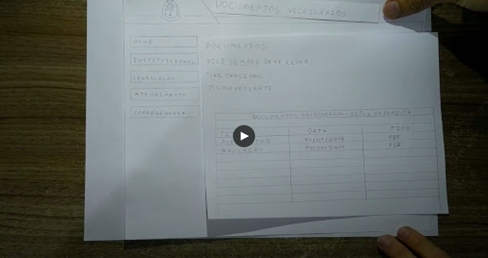

# Avaliação do Protótipo de Papel

## 1. Introdução

&emsp;A avaliação do protótipo em papel tem como objetivo verificar a usabilidade e interatividade por meio da observação e análise da interação do usuário com a interface.
Dessa forma, é possível assegurar ao usuário uma interface com boa usabilidade e interatividade. Essa avaliação utilizará como guia o documento de Planejamento da Avaliação do Protótipo de Papel desenvolvido anteriormente.

## 2. Avaliação e Perfil de Usuário

- Objetivo: identificar problemas na interação e na usabilidade da interface do site da Defensoria Pública de São Paulo.
- Perfil do participante:  
  &emsp;**Nome**: Lucas Silva  
  &emsp;**Idade**: 25  
  &emsp;**Profissão**: Dentista

## 3. Teste Piloto

## 4. Tarefas

&emsp;As tarefas que serão avaliadas são: <i>verificar documentos necessários para abrir uma petição, ler material institucional e verificar áreas de atuação.</i>

### Tarefa 1: Verificar documentos necessários para abrir uma petição

#### Fluxo da interação

1. Página inicial  
   &emsp;1.1. Documentos necessários

&emsp;O usuário deve entrar na Página Inicial da Defensoria Pública do estado de São Paulo e após isso clicar no item Documentos Necessários, onde ele será direcionado para uma tela com os documentos necessários para abrir uma petição.

#### Dados Recolhidos

| Perguntas                                                                                                  | Respostas                                                                                                     |
| ---------------------------------------------------------------------------------------------------------- | ------------------------------------------------------------------------------------------------------------- |
| O usuário consegue operar o sistema? Ele atinge seu objetivo? Em quanto tempo? Após cometer quantos erros? | O usuário consegue operar o sistema e atingir os objetivos em cerca de 5 minutos, com 2 erros                 |
| Que parte da interface e da interação o deixa insatisfeito?                                                | O usuário acharia interessante se a tabela de documentos necessários também informasse o tamanho dos arquivos |
| Que parte da interface o desmotiva a explorar novas funcionalidades?                                       | Os botões de atendimento já estarem dispostos na página inicial                                               |
| Ele entende o que significa e para que serve cada elemento de interface?                                   | Não                                                                                                           |
| Ele vai entender o que deve fazer em seguida?                                                              | Sim                                                                                                           |
| Que problemas de IHC dificultam ou impedem o usuário de alcançar seus objetivos?                           | Algumas dúvidas em relação ao que se fazer na página                                                          |
| Onde esses problemas se manifestam?                                                                        | Na tela de verificar documentos                                                                               |
| Com que frequência tendem a ocorrer?                                                                       | Apenas na primeira vez em que se acessa                                                                       |
| Qual é a gravidade desses problemas?                                                                       | Leve                                                                                                          |
| Quais barreiras o usuário encontra para atingir seus objetivos?                                            | Em baixar o arquivo em PDF para conseguir ver os documentos que certa área necessita                          |
| Ele tem acesso a todas as e informações oferecidas pelo sistema?                                           | Sim                                                                                                           |

### Tarefa 2: Abrir chat-bot e ler o material institucional

#### Fluxo da interação

**1.** Página inicial  
&emsp;**1.1.** Botão de chat  
&emsp;&emsp;**1.1.1.** Opção para saber mais sobre os temas descritos (SIM ou NÃO)  
&emsp;&emsp;&emsp;**1.1.1.1.** Temas apresentados (Caso SIM)  
&emsp;&emsp;&emsp;**1.1.1.2.** Temas não cobertos pela Defensoria Pública (Caso NÂO)

&emsp;O participante deve entrar na Página Inicial da Defensoria Pública do estado de São Paulo e após isso clicar no botão com o ícone de chat, onde será renderizado um <i>pop-up¹</i> no qual o usuário terá acesso ao chat. No chat, será indagado se o usuário deseja saber mais sobre os temas listados. Caso a resposta seja sim, o chat-bot apresentará as informações acerca do terma. Caso a resposta seja não, ele apresentará outras questões que não são cobertas pela Defensoria Pública e caso o usuário relate que algumas das questões citadas nessa etapa da interação seja de seu interesse, ele apresentará os canais referentes às demandas do usuário.

¹:<i>pop-up</i> é uma janela o item que se abre em um site quando o usuário interagem com um determinado <i>link</i> ou item.

#### Dados Recolhidos

| Perguntas                                                                                                  | Respostas                                                                                         |
| ---------------------------------------------------------------------------------------------------------- | ------------------------------------------------------------------------------------------------- |
| O usuário consegue operar o sistema? Ele atinge seu objetivo? Em quanto tempo? Após cometer quantos erros? | O usuário consegue operar o sistema e atingir seu objetivo em cerca de 2 minutos, com nenhum erro |
| Que parte da interface e da interação o deixa insatisfeito?                                                | -                                                                                                 |
| Que parte da interface o desmotiva a explorar novas funcionalidades?                                       | -                                                                                                 |
| Ele entende o que significa e para que serve cada elemento de interface?                                   | Sim                                                                                               |
| Ele vai entender o que deve fazer em seguida?                                                              | Sim                                                                                               |
| Que problemas de IHC dificultam ou impedem o usuário de alcançar seus objetivos?                           | -                                                                                                 |
| Onde esses problemas se manifestam?                                                                        | -                                                                                                 |
| Com que frequência tendem a ocorrer?                                                                       | -                                                                                                 |
| Qual é a gravidade desses problemas?                                                                       | Sem gravidade                                                                                     |
| Quais barreiras o usuário encontra para atingir seus objetivos?                                            | Nenhuma                                                                                           |
| Ele tem acesso a todas as e informações oferecidas pelo sistema?                                           | Sim                                                                                               |

### Tarefa 3: Verificar áreas de atuação da Defensoria

#### Fluxo da interação

**1.** Página inicial  
&emsp;**1.1.** Área de atuação

&emsp;O participante deve entrar na Página inicial e selecionar o item Áreas de atuação, onde será redirecionado para um menu que apresentará em quais áreas a Defensoria Pública atua.

#### Dados Recolhidos

| Perguntas                                                                                                  | Respostas                                                                                    |
| ---------------------------------------------------------------------------------------------------------- | -------------------------------------------------------------------------------------------- |
| O usuário consegue operar o sistema? Ele atinge seu objetivo? Em quanto tempo? Após cometer quantos erros? | O usuário consegue operar o sistema e atingir os objetivos em cerca de 5 minutos, com 1 erro |
| Que parte da interface e da interação o deixa insatisfeito?                                                | O usuário acreditou que o que ele procurava estava em outra página                           |
| Que parte da interface o desmotiva a explorar novas funcionalidades?                                       | Os botões de atendimento já estarem dispostos na página inicial                              |
| Ele entende o que significa e para que serve cada elemento de interface?                                   | Não                                                                                          |
| Ele vai entender o que deve fazer em seguida?                                                              | Não                                                                                          |
| Que problemas de IHC dificultam ou impedem o usuário de alcançar seus objetivos?                           | Falta de clareza nos botões                                                                  |
| Onde esses problemas se manifestam?                                                                        | Na página inicial                                                                            |
| Com que frequência tendem a ocorrer?                                                                       | Toda vez que um usuário não conhece as funcionalidades                                       |
| Qual é a gravidade desses problemas?                                                                       | Média                                                                                        |
| Quais barreiras o usuário encontra para atingir seus objetivos?                                            | Entender o que cada página possui de informação                                              |
| Ele tem acesso a todas as e informações oferecidas pelo sistema?                                           | Sim                                                                                          |

## 5. Conclusão

&emsp; Os resultados das entrevistas foram muito bons e úteis para a continuação do projeto. Seguindo o teste-piloto foi possível corrigir alguns problemas que o protótipo de papel tinha. Através das entrevistas também foram possíveis observar os erros de design que serão considerados para os próximos protótipos.

## 6. Versionamento

|    Data    | Versão |                            Descrição                            |               Autor               |
| :--------: | :----: | :-------------------------------------------------------------: | :-------------------------------: |
| 22/04/2021 |  1.0   | Desenvolvimento do documento de Avaliação do Protótipo de Papel | Guilherme Fernandes e Ítalo Alves |
| 23/04/2021 |  2.0   |      Revisão do documento e adição do tópico de conclusão       |         Lucas Boaventura          |
| 25/04/2021 |  3.0   |                Adição do tópico de teste piloto                 |            Ítalo Alves            |
