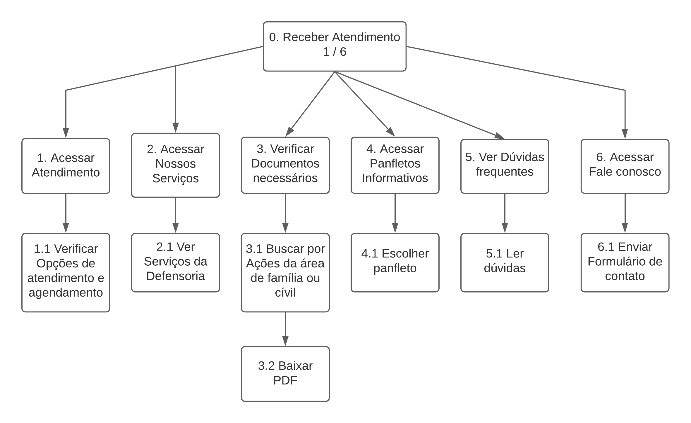

# Análise de Tarefas

&emsp; A análise de tarefas é utilizada para se entender sobre qual é o esforço dos usuários, como e por quê eles o realizam.

## Metodologia

&emsp; Nesse tipo de análise, o esforço do usuário é definido em termos dos objetivos que eles querem ou precisam atingir. Existem algumas análises de tarefas, e a escolhida para se utilizar no projeto da disciplina foi a Análise Hierárquica de tarefas.

&emsp; A Análise Hierárquica foi desenvolvida em 1960 para ajudar a entender as competências e habilidades exibidas em tarefas complexas e não repetitivas. Ajuda também a relacionar o que as pessoas fazem, ou deveriam fazer, porque fazem isso, e quais as consequências caso não seja feito corretamente. É utilizada uma fundamentação na psicologia funcional.

## Análise sobre o atendimento

  

| Objetivos/operações                               |                                                                                                                                        Problemas e recomendações                                                                                                                                        |
| :------------------------------------------------ | :-----------------------------------------------------------------------------------------------------------------------------------------------------------------------------------------------------------------------------------------------------------------------------------------------------: |
| 1. Receber atendimento 1 > 1.1                    |                                                                              **plano:** Acessar a opção de atendimento. **problema:** A opção de atendimento está com uma fonte e tamanho ruins e não parece ser clicável.                                                                              |
| 1.1 Verificar opções de atendimento e agendamento |                                                          **plano:** Verificar as opções de atendimento. **problema:** Página mostra as opções, mas tem um texto superior que está muito grande e as opções são imagens que fingem ser botões.                                                           |
| 2. Acessar nossos serviços 2 > 2.1                |                                                            **plano:** Acessar a opção de atendimento. **problema:** Página mostra as opções, mas tem um texto superior que está muito extenso e a opção é uma imagem que finge ser um botão.                                                            |
| 2.1 Ver serviços da Defensoria                    |                                                            **plano:** Verificar quais são os serviços. **problema:** Página colorida e com fontes ruins sem explorar o tamanho das fontes pra informar as partes mais importantes da página.                                                            |
| 3. Verificar documentos necessários 3 > 3.1 > 3.2 |                                                         **plano:** Verificar os documentos necessários. **problema:** Página mostra as opções, mas tem um texto superior que está muito extenso e a opção é uma imagem que finge ser um botão.                                                          |
| 3.1 Buscar por ações da área de família ou civil  |                                                                     **plano:** Escolher a área da ação. **problema:** Não parece claras as opções de áreas, a busca é um retângulo e o botão de pesquisar não parece ser clicável.                                                                      |
| 3.2 Baixar pdf                                    |                                                                **plano:** Baixar pdf. **problema:** Díficil leitura das opções que podem baixar, utiliza ícones antigos e mostra tamanho do arquivo que não é interessante pro usuário.                                                                 |
| 4. Acessar panfletos informativos 4 > 4.1         |                                                         **plano:** Verificar os panfletos informativos. **problema:** Página mostra as opções, mas tem um texto superior que está muito extenso e a opção é uma imagem que finge ser um botão.                                                          |
| 4.1 Escolher panfleto                             |                                        **plano:** Escolher o panfleto. **problema:** Utiliza imagens de diversas cores como botões e possui um texto ruim de ler dependendo da quantidade de caracteres, além de uma imagem perdida na parte debaixo da página.                                         |
| 5. Ver dúvidas frequentes 5 > 5.1                 |                                                           **plano:** Verificar as dúvidas frequentes. **problema:** Página mostra as opções, mas tem um texto superior que está muito extenso e a opção é uma imagem que finge ser um botão.                                                            |
| 5.1 Ler dúvidas frequentes                        | **plano:** Ler as dúvidas frequentes. **problema:** Página mostra as dúvidas, mas não da pra saber onde começa e onde termina, existem alguns links que estão mal colocados na tela, não utiliza o tamanho da fonte pra mostrar a parte mais importante da tela, não é intuitiva a leitura das dúvidas. |
| 6. Acessar fale conosco 6 > 6.1                   |                                                         **plano:** Ver como pode falar com a defensoria. **problema:** Página mostra as opções, mas tem um texto superior que está muito extenso e a opção é uma imagem que finge ser um botão.                                                         |
| 6. Enviar formulário de contato                   |                     **plano:** Preencher formulário de contato e enviar. **problema:** cada input é de um tamanho, a tela do formulário está alinhada a esquerda da tela e tem um scroll pouco intuitivo já que sobrou muito espaço em branco no centro e no lado direito da tela.                      |

## Análise sobre o atendimento virtual com chat-bot

  

| Objetivos/operações                             |                                                                                                                                     Problemas e recomendações                                                                                                                                      |
| :---------------------------------------------- | :------------------------------------------------------------------------------------------------------------------------------------------------------------------------------------------------------------------------------------------------------------------------------------------------: |
| 0. Abrir o atendimento virtual                  |                                                                                                  **plano:** Abrir o chat-bot na página inicial para receber o atendimento virtual da Defensoria.                                                                                                   |
| 1.1 Inserir o nome                              |                                                                                                               **input:** Nome que o usuário gostaria de ser chamado durante o chat.                                                                                                                |
| 1.2 Saber mais sobre os temas descritos? 1 / 2  |                                                                                  **input:** Botões com resposta SIM ou NÃO. **plano:** Os botões respondem a pergunta feita e levam a outras funções disponíveis.                                                                                  |
| 1.4 Responder NÃO                               |                                                                              **plano:** As outras funcionalidades disponíveis são puladas e o usuário vai direto ao passo de receber atendimento na área selecionada.                                                                              |
| 1.3 Responder SIM                               |                                                                                                                  **plano:** As outras funcionalidades disponíveis são mostradas.                                                                                                                   |
| 1.3.1 Ler Material Institucional                | **plano:** Uma mensagem com as informações sobre o material institucional com um link que levam a uma nova janela. **problema:** Ao abrir uma nova janela, uma página com bastante informação extra e layout totalmente distinto da janela atual é aberta, podendo causar confusão para o usuário. |
| 1.3.2 Continuar com o atendimento? 1 / 2        |                                                                     **input:** Botões com resposta SIM ou NÃO. **plano:** Os botões respondem a pergunta e podem encerrar o chat ou receber o atendimento na área selecionada.                                                                     |
| 1.3.3 Responder NÃO                             |                                                                                                                                   **plano:** O chat é encerrado.                                                                                                                                   |
| 1.3.4 Responder SIM                             |                                                                                                                  **plano:** O usuário é direcionado para receber o antendimento.                                                                                                                   |
| 1.3.4.1 Receber atendimento na área selecionada |                                           **input:** Resposta sobre as perguntas de acordo com a necessidade do usuário, elas podem ser "SIM" ou "NÃO". **plano:** As respostas guiam o usuário até um atendente real para que seja feito o agendamento.                                           |

## Análise sobre o institucional

  

| Objetivos/operações                       |                                                                                                                                                                       Problemas e recomendações                                                                                                                                                                        |
| :---------------------------------------- | :--------------------------------------------------------------------------------------------------------------------------------------------------------------------------------------------------------------------------------------------------------------------------------------------------------------------------------------------------------------------: |
| 1. Acessar 'Quem somos' 1 > 1.2           |                                                      **plano:** Ver as opções ao clicar nessa opção. **problema:** A opção de atendimento está com uma fonte e tamanho ruins e não parece ser clicável, ao passar a mouse por cima aparece um quadrado colorido com algumas opções que não são bonitas de se ver.                                                      |
| 1.2 Ver informações                       |                                   **plano:** Ver as informações sobre o que é a Defensoria. **problema:** A tela possui um título e um texto desalinhado e que ocupa uma grande largura da tela o que torna a leitura meno intuitiva, além de não explorar tamanhos de fontes e cores no texto pra evidenciar os temas e os botões.                                    |
| 2. Verificar áreas de atuação 2 > 2.1     |                                                                                             **plano:** Clicar no botão para ver as áres de atuação da Defensoria. **problema:** A tela possui muito texto ocupando uma grande largura da tela com uma fonte muito pequena.                                                                                             |
| 2.1 Ver as áreas de atuação               |                                                                                         **plano:** Ver as áres de atuação da Defensoria. **problema:** Os links de texto estão na cor verde e não chama muito a atenção, e ao entrar na tela não dá vontade de ler os tópicos.                                                                                         |
| 3. Acessar saiba mais 3 > 3.1             |                                                                                  **plano:** Acessar a tela de Saiba mais. **problema:** O retângulo que aparece na tela é pequeno e colorido com um amarelo apagado e ao passar o mouse em cima a opção fica maior o que é diferente.                                                                                  |
| 3.1 Ver mais informações                  |                                                                                        **plano:** Ver mais informações na tela. **problema:** A tela possui um título com um fundo colorido e mal alinhado em relação ao texto, e todas as letras do texto tem o mesmo tamanho.                                                                                        |
| 4. Verificar defensores 4 > 4.1           |                                                                                  **plano:** Acessar a tela de defensores. **problema:** O retângulo que aparece na tela é pequeno e colorido com um amarelo apagado e ao passar o mouse em cima a opção fica maior o que é diferente.                                                                                  |
| 4.1 Ver defensores                        |                                                 **plano:** Ver os defensores. **problema:** Aparece uma tabela que não ocupa todo o comprimeto da tela e possui um scroll escondido e cada linha da tabela é muito pequena e colada no texto, além de uma barra de busca sem estilo algum e utilizando ícones antigos.                                                 |
| 5. Acessar órgãos 5 > 5.1                 |                                                                                         **plano:** Acessar a tela de listagem de órgãos. **problema:** O retângulo que aparece na tela some muito fácil e é difícil clicar em algum item sem sasir do retângulo que é pequeno.                                                                                         |
| 5.1 Ver órgãos                            |                                      **plano:** Ver os órgãos listados. **problema:** Existe uma imagem mostrando um fluxo de hierarquia dos órgãos que está mal alinhada na tela, a lista de órgãos é uma tabela com as opções verdes e mal colocadas na tela, parece que estão jogadas e tem umas com a fonte menor que outras.                                      |
| 6. Acessar núcleos especializados 6 > 6.1 |                                                                                             **plano:** Acessar a tela de listagem de núcleos especializados. **problema:** O retângulo que aparece na tela possui umas bordas verdes escuro que não combinam com o fundo.                                                                                              |
| 6.1 Ver informações dos núcleos           | **plano:** Ver a tela de listagem de núcleos especializados. **problema:** Existe um texto alinhado a esquerdo e muito extenso ocupando quase toda a largura da tela, e abaixo possui a lista de núcleos que utilizam imagens de baixa resolução e um texto em verde que é clicável, e possui uma imagem no footer na página que não existe nas outras telas do fluxo. |

## Referências

- SIMONE DINIZ JUNQUEIRO BARBOSA, BRUNO SANTANA DA SILVA, Interação Humano-Computador, 1a . Edição, Editora Campus, 2010

## Versionamento

|    Data    | Versão |                  Descrição                  |            Autores             |
| :--------: | :----: | :-----------------------------------------: | :----------------------------: |
| 16/03/2021 |  0.1   | Criação da estrutura principal do documento | Lucas Boaventura e Ítalo Alves |
| 18/03/2021 |  1.0   |        Desenvolvimento do documento         | Lucas Boaventura e Ítalo Alves |
