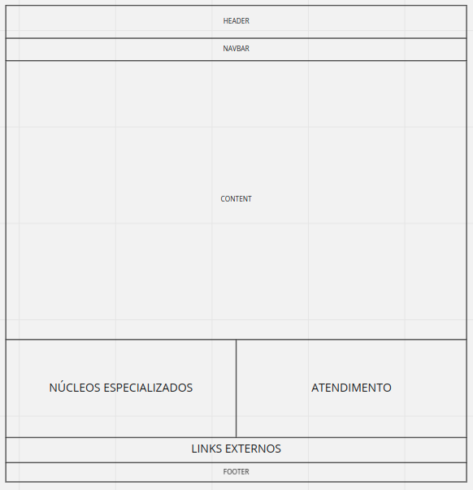
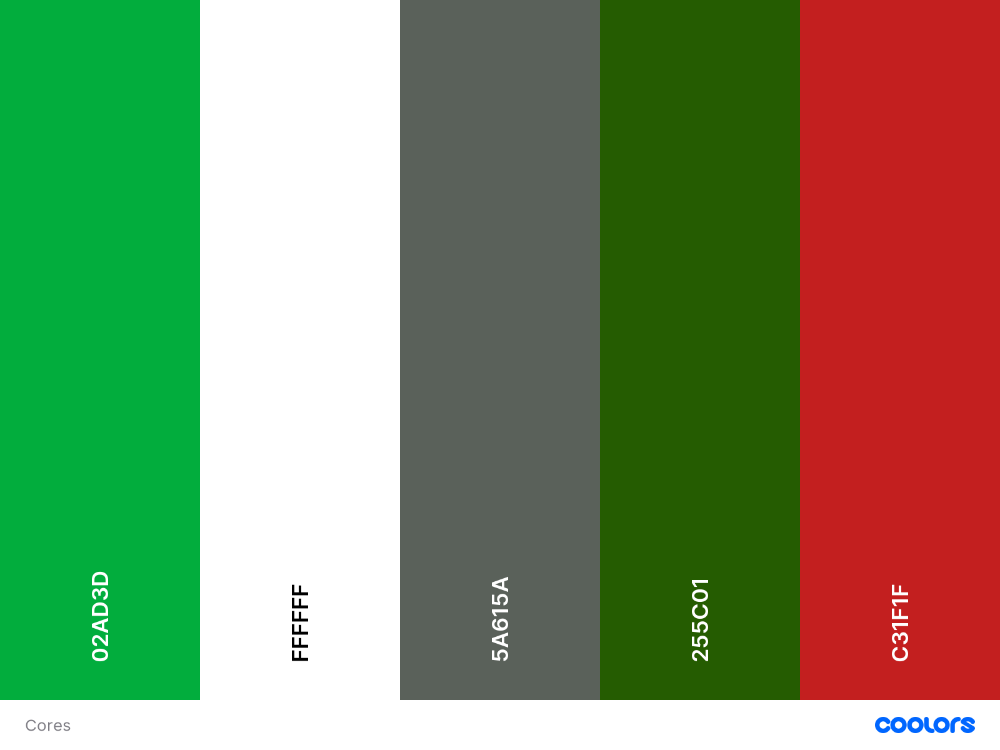
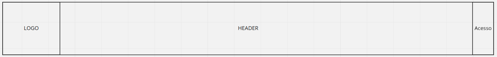
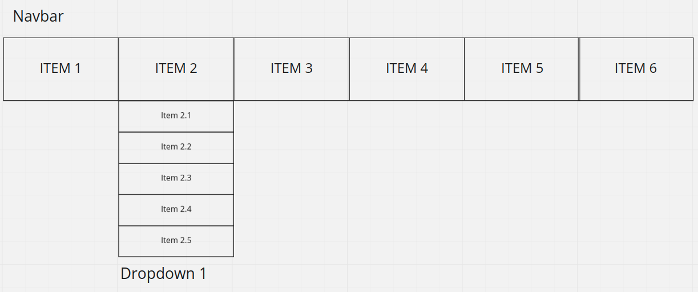

# Guia de Estilos

## 1. Introdução

&emsp;Trata-se de um registro das principais decisões de design tomadas, de forma que elas não se percam, isto é, sejam efetivamente incorporadas no produto final.

### 1.1. Objetivo

&emsp;Guias de estilo servem de ferramenta de comunicação entre os membros da equipe de design e também com a equipe de desenvolvimento. É importante que as decisões de design possam ser facilmente consultadas e reutilizadas nas discussões sobre extensões ou versões futuras do produto. &emsp;O site da defensoria de São Paulo não possui um guia de estilo público, sendo assim, criaremos um já com as novas decisões de melhorias para o sistema em questão.

### 1.2. Organização e conteúdo

&emsp;A organização do guia de estilo será baseada na estrutura que Marcus(1992) e Mayhem(1999) recomendam.

### 1.3. Público-alvo

&emsp;O público alvo deste guia de estilo é a equipe de desenvoldedores e a equipe de design do website, assim também como para os integrantes do grupo 3 que desenvolverão um protótipo de alta fidelidade ao decorrer do projeto.

### 1.4. Como utilizar

&emsp;Para utilizar este guia, basta apenas seguir as orientações de cada tópico. Utilizando sempre os elementos citados e seguindo as regras propostas

### 1.5. Como manter

&emsp;Para manter o guia, lembre sempre dos fundamentos de IHC para uma boa usabilidade. Todo este guia tem como objetivo melhorar os fundamentos neste website, logo, mesmo realizando refatorações neste documento, se estas mudanças estiverem seguindo os princípios básicos, você está no caminho certo. Caso precise de material para se aprofundar neste conteúdo, cheque os materiais citados no tópico de referências ao final do documento.

## 2. Descrição do ambiente de trabalho do usuário

&emsp;O website da Defensoria do estado de São Paulo permite a interação do usuário através de cliques em elementos na tela. Tendo isso em vista, o ambiente de trabalho do usuário é qualquer navegador web que ele utilize, permitindo o acesso ao site. É importante ressaltar que o monitor utilizado pode ser diferente para cada usuário, logo o design deve ser responsivo para cada resolução, permitindo a melhor experiência para todos usuários.

## 3. Elementos de Interface

&emsp;Aqui iremos pegar os elementos que já existem no website da defensoria e iremos trabalhar em cima deles para gerar elementos melhores segundo os princípios de IHC.

### 3.1. Disposição Espacial e Grid

&emsp;A disposição atual não proporciona uma boa distribuição dos itens na tela, deixando diversos conteúdos espalhados e sem muitas informações sobre sua relevância em relação website. O nosso objetivo em toda aplicação será exemplificada com a tela Home, que é a primeira apresentada ao usuário ao acessar o link. 
&emsp;Na imagem abaixo tentamos mostrar basicamente como pretendemos disponibilizar os elementos na tela, deixando sempre bem definido onde e o que cada seção contém. Um ponto importante é a padronização entre todas as páginas, logo seções que contém a mesma categoria de elementos irão, sempre que possível, ter o mesmo posicionamento na tela.

### 3.2. Janelas

&emsp;As janelas do website irão se manter as atuais, pois cada uma exemplifica bem o que deve ser mostrado, não havendo repetição de conteúdos ou conteúdos irrelevantes para a aplicação. As páginas são:

* Home
* Institucional
* Legislação
* Atendimento
* Corregedoria
* Conselho Superior
* Sala de Imprensa
* Ciclo de Conferências
* Centro de Atendimento Multidisciplinar
* Convive - Mães em Cárcere
* Endereços e Telefones
* Plantões Judiciários
* Núcleos Especializados
* Serviços Gerais

### 3.3. Tipografia

&emsp;A tipografia trata-se, de forma geral, de uma base da comunicação verbal. Em específico quando analisada em relação a produtos de software dentro do contexto de padronização e detalhamento de estilos envolve o estudo, criação e aplicação de caracteres, estilos, formatos e da disposição visual de palavras dentro do sistema. A descrição da tipografia pode ser feita utilizando quatro principais aspectos:

* Classificação de fonte
* Família tipográfica
* Medida tipográfica
* Tipo de alinhamento

&emsp;Atualmente, o site em questão utiliza como fonte principal a Arial, variando de cor e tamanho de acordo com o contexto e relevância das informações. A nova proposta seria passar a considerar como fonte principal a Rawline, utilizada por padrão na maioria dos sites governamentais atuais e de melhor expressão visual de acordo com o caráter da página exibida, além de possuir uma variedade de estilos que torna desnecessária a utilização de outra família tipográfica. Segue um exemplo para comparação visual entre as fontes analisadas:

- ### Arial 

- ### Rawline 

### 3.4. Símbolos não Tipográficos

#### 3.4.1. Ícones de menus

#### 3.4.2. Ícones de redes sociais

#### 3.4.1. Logo

### 3.5. Cores

&emsp;Aqui definimos todas as cores já existentes no website e também adicionamos um tom de vermelho, devido à logo da defensoria, e para podermos ter uma maior variedade na hora de colorir os elementos.

## 4. Elementos de Interação

&emsp;Aqui iremos descrever os elementos que poderão interagir com o usuário. Aqui pensamos principalmente na experiência do usuário ao utilizar estes elementos, são eles:

### 4.1. Estilos de interação
* **Navbar:** será uma barra horizontal para a navegação do usuário no website, possuirá Dropdowns, que serão explicados abaixo. Cada item da navbar será um link para a navegação.
* **Dropdown:** é um menu vertical, que possui um título que, ao ser clicado, abre a lista com os subitems.
* **Cards:** aqui serão os elementos que possuem geralmente uma imagem, pois podemos adicionar à essa imagem uma descrição. Ele pode ser tanto um link como um card explicativo, que poderá expandir para mostrar um conteúdo maior.
* **Sliders:** é um painel de conteúdos em que o seu conteúdo principal muda em um tempo determinado para dar lugar a outro conteúdo. Isso serve para mostrar conteúdos variados em um mesmo lugar para o usuário. O mesmo poderá navegar entre os conteúdos ou clicar para ser redirecionado à página deste conteúdo.
* **Formulários:** serão utilizados para login, para contato ou para qualquer outra atividade em que é necessário obter uma informação do usuário.

### 4.2. Seleção de um estilo

&emsp;Utilizaremos todos os estilos citados acima, pois cada um pode ser encaixado em um contexto.

### 4.3. Aceleradores

&emsp;Utilizaremos apenas os aceleradores mais intuitivos ao usuário, como TAB para mudar o campo selecionado em um formulário ou menu e ENTER, para o envio de formulários.

## 5. Elementos de Ação

&emsp;Aqui iremos listar os elementos que ativam uma ação no sistema.

### 5.1. Preenchimento de campos

&emsp;Aqui temos os campos de preenchimento em um formulário, que fornece informações do usuário ao sistema.

### 5.2. Seleção

&emsp;Aqui temos links e menus, tanto na navbar quanto em dropdowns, para navegação entre à páginas do website.

### 5.3. Ativação

&emsp;Aqui temos os botões, que servem para a confirmação de formulários e ações no geral, assim como servem para interagir com os componentes, como cards, sliders e, dependendo do contexto, dropdowns.

## 6.Vocabulários e Padrões

### 6.1. Terminologia
* **Corregedoria:** Órgão encarregado pela fiscalização e orientação dos servidores e defensores da defensoria quanto ao cumprimento de suas obrigações.
* **Conselho Superior:** Órgão deliberativo responsável pela determinação de parâmetros mínimos de qualidade da atuação dos defensores públicos, bem como a tomada de decisão em relação ao plano anual de atuação da instituição, eleição e afastamento dos defensores.
* **Ciclo de Conferências:** Mecanismo de participação desenvolvido com o intuito de ouvir melhorias propostas pela população do estado em relação a atuação da defensoria.
* **Plantões Judiciários:** Sistema de plantões oferecido pela defensoria para atender casos urgentes durante os feriados e finais de semana.
* **Licitações:** Exposição dos procedimentos administrativos que formalizam a contratação de serviços adquiridos pela defensoria.

### 6.2. Tipos de Tela

&emsp;Na defensoria, todas as páginas, independente do que for acessado, possuirão como padrão a exibição dos componentes da navbar, header, footer e links externos:

## Referências
 BARBOSA, Simone; SILVA, Bruno. "Interação Humano-Computador". Elsevier Editora Ltda, 2010.

## Versionamento

|    Data    | Versão |                  Descrição                  |               Autores               |
| :--------: | :----: | :-----------------------------------------: | :---------------------------------: |
| 23/03/2021 |  1.0   | Criação do Guia de Estilo | Brenda Santos e Tiago Samuel |
| 25/03/2021 |  2.0   | Revisão do documento e ajusta formatação  | Lucas Boaventura |

