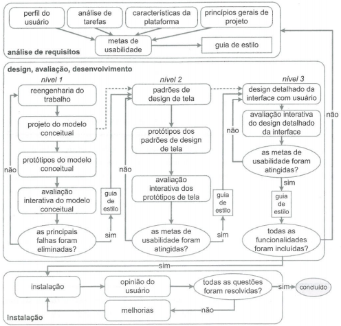

# Processo de Design

## 1. Introdução

 &emsp; O processo de design é uma parte muito importante, pois é nele que há o detalhamento das atividades básicas propostas no design, que são: a análise da situação atual, a síntese de uma intervenção e a avaliação desse intervenção. Tendo em conhecimento, que existem várias propostas de processo de design de IHC e cada uma possui uma forma diferente de pensar, a equipe debateu e chegou a conclusão que o modelo engenharia de usabilidade de Mayhew seria o mais conveniente para a realização deste projeto.

## 2. Ciclo de Mayhew

  

 &emsp; É um ciclo criado para a engenharia de usabilidade. Esse processo traz a organização de diversas atividades da área de IHC.

 &emsp; Foi escolhido o processo de Mayhew porque ele propôs que após o a análise de requisitos o é preciso especificar as metas de usabilidade do software em **três níveis** de aspectos de uma interface:

1. Interface de forma conceitual.
2. Definições de estilo.
3. Interações e componentes relacionados com as tarefas.

## 3. Análise de Requisitos

 &emsp; Nesta fase do ciclo, há um levantamento de informações acerca do perfil dos usuários, análise de tarefas, possibilidades e limitações da plataforma em que sistema será executado, e princípios gerais de design de IHC, para utilizar como base na hora da definição das metas de usabilidade.

## 4. Design, avaliação e desenvolvimento

 &emsp; Essa fase do ciclo tem por objetivo a **concepção de uma solução**, que se baseia nas metas de usabilidade definidas anteriormente, durante a análise de requisitos. Nesse processo, a solução de IHC é projetada em **três níveis** diferentes de detalhamento.

 &emsp; No **primeiro nível**, o designer repensa a execução das tarefas para que se possa alcançar o objetivo dos usuários, elaborando alternativas de solução e protótipos de baixa fidelidade - essas tarefas são a realização da reengenharia do trabalho.

 &emsp; No **segundo nível**, o designer estabelece os padrões de design de IHC para a solução que ele está concebendo e constrói protótipos de média fidelidade avaliáveis por ele.

 &emsp; No **terceiro nível**, o designer deve elaborar detalhadamente o protótipo de alta fidelidade do projeto que irá ser implementado.

 &emsp; Já no **desenvolvimento do sistema**, a interface é **avaliada** com a participação dos usuários.

## 5. Instalação

 &emsp; A fase de **instalação** do sistema, que depois de um tempo de uso, permite que os usuários possam avaliar a usabilidade do software, de forma mais genuína de acordo com as suas experiências.

 &emsp; Para se coletar avaliações dos usuários, pode se utilizar de testes de usabilidade, ou métodos de análise como entrevistas, observações e questionários.

## 6. Bibliografia

- SILVA, Rodrigo; MENDONÇA, Jônatas. Um estudo do relacionamento entre técnicas de
  usabilidade e testes automatizados em métodos
  empíricos de desenvolvimento de software; 2014.

- SIMONE DINIZ JUNQUEIRO BARBOSA, BRUNO SANTANA DA SILVA, Interação Humano-Computador, 1a . Edição, Editora Campus, 2010

|    Data    | Versão |      Descrição       |                      Autor                      |
| :--------: | :----: | :------------------: | :---------------------------------------------: |
| 04/03/2021 |  1.0   | Criação do documento | Lucas Boaventura, Lorrany Oliveira, Ítalo Alves |
| 04/03/2021 |  1.1   | Revisão do documento |                   Ítalo Alves                   |
| 07/05/2021 |  1.2   | Revisa e padroniza documento | Tiago Samuel Rodrigues |
