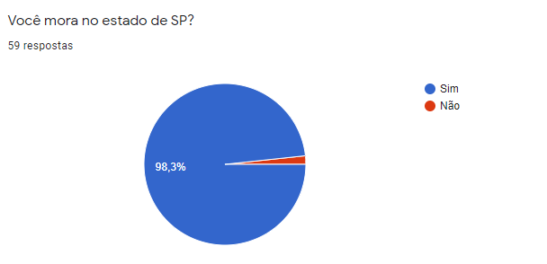
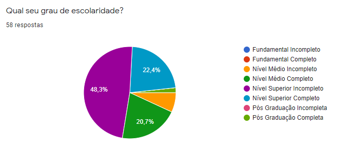
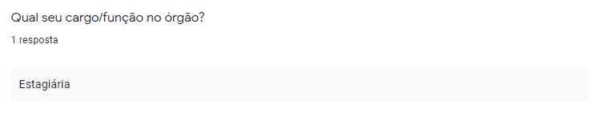
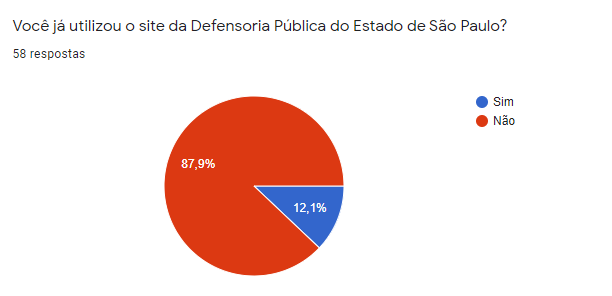
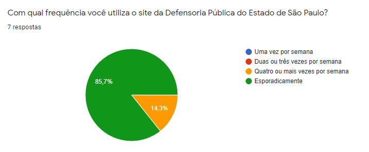
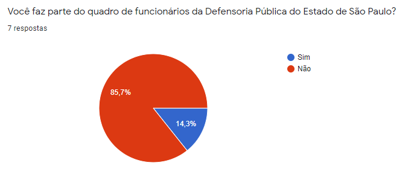
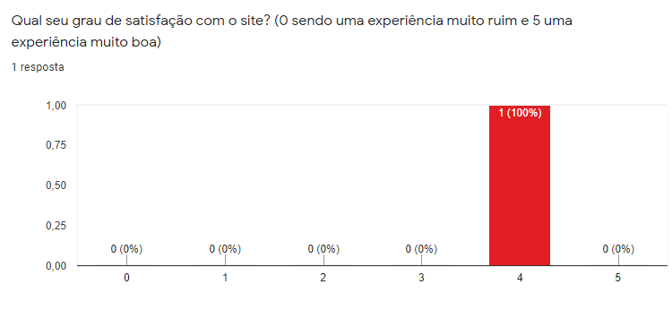

# Perfil de Usuários

## Metodologia

 &emsp; O documento de perfil de usuários tem, basicamente, a função de expor todo o detalhamento e os resultados da aplicação das metodologias utilizadas para traçar o perfil dos usuários. A partir dos traços obtidos, são agregados valores que permitem o encaixe de cada tipo de usuário em grupos, contemplando assim suas principais características. A construção de cada perfil é um processo quase que inteiramente interativo e os prioriza de acordo com os objetivos do projeto e do sistema em questão. Em específico no processo de análise da Defensoria Pública do Estado de São Paulo, foi escolhido o método de aplicação de questionários devido a possibilidade de atingir maior alcance, visto que o público de usuários alvo não pertence ao estado da equipe desenvolvedora do projeto. Os resultados obtidos contaram com a participação de cinquenta e nove voluntários até o momento de encerramento.

## Perguntas e Estatísticas

### 1. Perfil Demográfico

### 1. Perfil Tecnológico

## Perfis levantados

|               perfil                |                                        A                                        |   B   |        C        |
| :---------------------------------: | :-----------------------------------------------------------------------------: | :---: | :-------------: |
|         Já utilizou o site?         |                                       Sim                                       |  Não  |       Sim       |
|       Trabalha na defensoria?       |                                       Não                                       |  Não  |       Sim       |
| Com qual frequência utiliza o site? |                                 Esporadicamente                                 | Nunca | 4 ou mais vezes |
|  Com qual intuito utilizou o site?  | Entrar com ação, acessar cursos, obter informações sobre um determinado serviço |  N/A  |    Trabalho     |

## Versionamento

|    Data    | Versão |                  Descrição                  |               Autores               |
| :--------: | :----: | :-----------------------------------------: | :---------------------------------: |
| 16/03/2021 |  0.1   | Criação da estrutura principal do documento | Brenda Santos e Guilherme Fernandes |
| 18/03/2021 |  1.0   |      Elaboração dos tópicos principais      | Brenda Santos e Guilherme Fernandes |
| 18/03/2021 |  2.0   |      Revisa documento e formata corretamente      | Lucas Boaventura |
